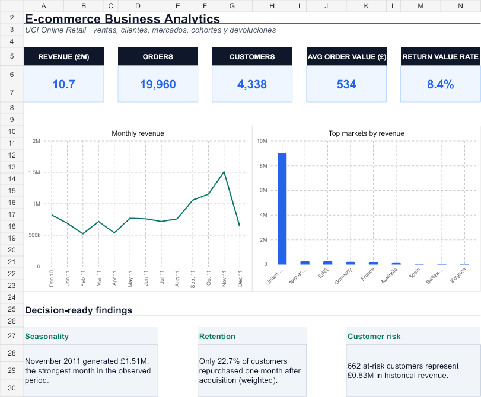
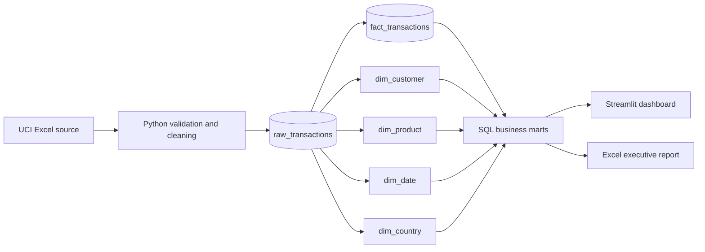

# E-commerce Business Analytics

[](https://www.python.org/)
[](https://duckdb.org/)
[](https://streamlit.io/)
[](#quality-controls)

An end-to-end analytics case study that turns **541,909 raw transaction lines** into an
auditable star schema, commercial KPIs, customer segments, retention cohorts, an interactive
dashboard, and a recruiter-friendly Excel report.



## Executive summary

The analysis covers a UK-based online retailer from December 2010 to December 2011. Positive
sales are deliberately separated from cancellations and returns, while customer-level metrics
exclude anonymous transactions only where identity is required.

| KPI | Result |
|---|---:|
| Sales revenue | **£10.67M** |
| Orders | **19,960** |
| Known customers | **4,338** |
| Average order value | **£534.40** |
| Units sold | **5.59M** |
| Return value / sales | **8.4%** |

## Business findings

1. **Demand peaks sharply before Christmas.** November 2011 generated £1.51M, the strongest
   full month in the observed period. Capacity, inventory and campaign planning should ramp
   before Q4 rather than during the peak.
2. **Retention is the clearest growth opportunity.** Only 22.7% of acquired customers purchased
   again one month later on a weighted basis. A post-purchase lifecycle should be tested before
   increasing acquisition spend.
3. **A valuable group is at risk.** The RFM model identifies 662 at-risk customers representing
   £0.83M in historical sales. This is a focused win-back audience rather than a generic discount
   list.
4. **International scale and order economics differ.** The Netherlands and EIRE lead
   international revenue, while the Netherlands and Australia show unusually high order values.
   These markets merit a separate profitability review that includes shipping costs.
5. **The product ranking needs business rules.** Postage, fees and accounting adjustments are
   excluded from merchandise rankings, preventing operational codes from appearing as “top
   products.”

## Questions answered

- How are revenue, orders, active customers and order value changing over time?
- Which markets combine scale, customer reach and high-value baskets?
- Which merchandise products generate the most revenue and repeat demand?
- Which customer groups are champions, loyal, promising, at risk or hibernating?
- How quickly do acquisition cohorts return in subsequent months?
- How material are cancellations and returns relative to positive sales?

## Data model



The SQL layer includes a line-level fact table, four conformed dimensions and marts for monthly
performance, countries, products, RFM segments, cohorts and data-quality reconciliation.

## Repository guide

```text
.
├── app.py                         # Interactive Streamlit dashboard
├── src/
│   ├── pipeline.py                # Download, validation, model build and exports
│   ├── insights.py                # Reproduce headline findings
│   └── workbook_payload.py        # Typed inputs for the Excel deliverable
├── sql/
│   ├── 01_star_schema.sql         # Fact and dimensions
│   ├── 02_business_marts.sql      # KPIs, RFM and cohorts
│   └── 03_interview_queries.sql   # Five reusable analytical questions
├── tests/test_pipeline.py         # Transformation tests
├── reports/ecommerce-business-analytics.xlsx
└── DATA_DICTIONARY.md
```

## Run locally

```bash
python -m venv .venv
# Windows: .venv\Scripts\activate
# macOS/Linux: source .venv/bin/activate
python -m pip install -r requirements.txt
python -m src.pipeline
pytest -q
streamlit run app.py
```

The pipeline downloads the official workbook automatically and creates a local DuckDB database
plus analysis-ready CSV exports. Raw and processed transaction data are intentionally excluded
from Git.

If you only want to review the finished analysis, download the
[Excel executive report](reports/ecommerce-business-analytics.xlsx).

## Quality controls

- 541,909 source rows reconcile to 541,909 modeled fact rows.
- Zero orphan customer keys and zero orphan product keys.
- Sales require positive quantity, positive price and a non-cancelled invoice.
- Returns and cancellations remain visible as a separate value measure.
- RFM scores use deterministic tie-breaking, so repeated runs produce the same segments.
- Unit tests cover header normalization and sale/return classification.

## Limitations

- The source does not include product cost, shipping cost or marketing spend, so this project
  measures sales rather than profit or campaign ROI.
- Customer IDs are missing on 135,080 rows. Those rows remain in commercial totals but cannot be
  included in customer segmentation or cohorts.
- December 2010 and December 2011 are partial months and should not be used for like-for-like
  monthly comparisons.
- RFM segments are analytical heuristics and should be validated through controlled campaigns.

## Data source

Chen, D. (2015). *Online Retail* [Dataset]. UCI Machine Learning Repository.
[https://doi.org/10.24432/C5BW33](https://doi.org/10.24432/C5BW33). Licensed CC BY 4.0.

## Author

**Ignacio Díaz** — Data Analyst · Python · SQL · Power BI  
[LinkedIn](https://www.linkedin.com/in/nachodiazgcom/) · [GitHub](https://github.com/Nchodiaz)
